# APACHE KAFKA

## NGƯỜI THỰC HIỆN

* Lê Thành Công - Software Development Fresher
* Trần Kiến Quốc - Software Development Fresher

<br/>

## MỤC LỤC

- [Sơ nét về Apache Kafka](#A)
- [Sơ nét về Zookeeper](#B)
- [Hướng dẫn cài đặt & sử dụng Kafka](#C)

<br/>

<span name="A"></span>

## SƠ NÉT VỀ APACHE KAFKA

* **Khái niệm:** Apache Kafka là một hàng đợi phân tán và mạnh mẽ, có thể xử lý dữ liệu khối lượng lớn và cho phép bạn chuyển các thông điệp từ điểm này sang điểm khác.
* **Mục tiêu:**
    * Xây dựng kênh (ống) truyền, nhận dữ liệu theo thời gian thực giữa hệ thống và ứng dụng.
    * Xây dựng ứng dụng nhận, xử lý các dữ liệu theo thời gian thực được gửi đến.
* **Về Kafka:**
    * Bản chất Kafka là một cluster, tập hợp nhiều server bên trong (tên gọi khác là `Broker`). Kafka cluster có thể dàn trải (tồn tại chia tách) trên nhiều trung tâm dữ liệu khác nhau.
    * Kafka cluster lưu trữ các trường thông tin, dữ liệu, tin nhắn (gọi là `record`) trong các `topic`.
    * Cấu trúc dữ liệu của mỗi `record` gồm `key`, `value`, `timestamp`.
    * Kafka sử dụng `Zookeeper` như một `trung tâm phân phối dữ liệu`.
    * Việc giao tiếp (truyền, nhận dữ liệu) giữa clients và servers dựa trên giao thức TCP.

        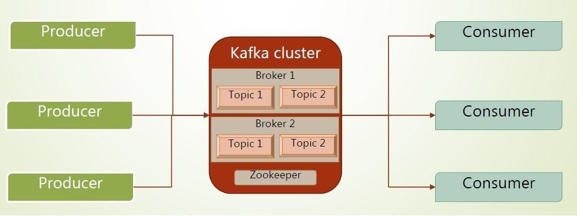

* **Hệ thống Publish, Subscribe (Pub/Sub) tin nhắn/thông tin của Kafka:**
    * `Producer`: Cho phép ứng dụng publish (gửi) những record vào 1 hoặc nhiều topic.
    * `Consumer`: Cho phép ứng dụng subsribe (nhận & xử lý) những record từ các topic mà nó đã chọn để theo dõi.

        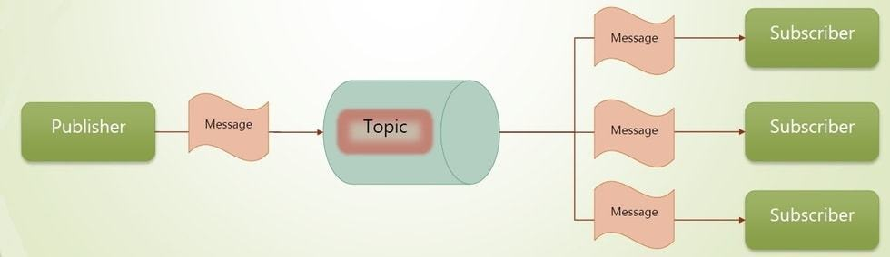

* **Topic:**
    * Kafka sử dụng `Topic` để chứa dựng, tổ chức các record được gửi đến.
    * Để cân bằng tải, một topic có thể được chia tách thành nhiều `partition` khác nhau và cho phép **nhân bản** nội dung của các partition ở broker này sang broker khác.
    * Các record trong partition có số ID theo trình tự và duy nhất (gọi là `offset`), không thể bị nhầm lẫn với các record khác.
    * Một topic có thể không có ai, hoặc ít nhất 1 consumer theo dõi.

        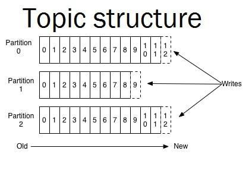

        

* **Partitions:**
    * Mục tiêu: Một topic chia thành các partition nhỏ nhằm mục đích *tăng cường khả năng nhận record từ publisher và gửi record song song đến các consumer/subscriber*. Từ đó, việc chia topic thành nhiều partition giúp tối ưu hiệu năng của hệ thống và tăng tốc cho hệ thống.
    * Các Partition được đánh dấu theo thứ tự khi được chia tách.
    * Kafka còn cho phép các partition được **nhân bản** sang các topic của các broker khác nhằm tăng cường **khả năng chống chịu lỗi** (insuring fault tolerance).

        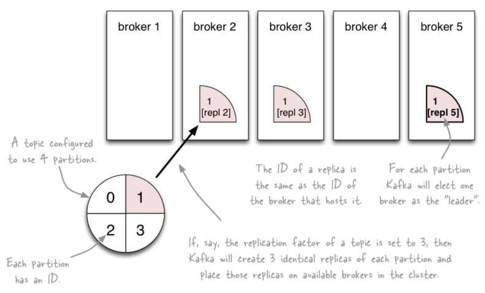

* **Fault Tolerance:**
    * Khi topic được chia thành các partition và các partition được nhân bản từ broker này sang broker khác, thì Kafka sẽ chọn một trong các broker đó để làm `leader`. Khi leader chết, một trong các nhân bản sẽ được đưa lên làm leader.
    * Khi leader có sự thay đổi dữ liệu, các phần partition con (gọi là `followers`) cũng sẽ được cập nhật theo.
    * Mỗi broker thường có một vài partition làm leader và một vài partition là follower.
* **Retention:**
    * Kafka cluster giữ lại các record khi nhận từ publisher trong một khoảng thời gian được cấu hình sẵn (dù đã được consumer/subscriber lấy được thông tin hay chưa thì Kafka cluster vẫn còn giữ nó). Sau khi hết khoảng thời gian trên, record tự động bị xóa.
* **Producer:**
    * Publish record đến các topic thông qua việc gắn dữ liệu vào các partition tương ứng.
    * Các hệ thống producer có thể thực hiện ghi dữ liệu vào các phân vùng dữ liệu (partition) theo cơ chế `round-robin`. *(Round robin là thuật toán luân chuyển vòng, các máy chủ sẽ được xem ngang hàng và sắp xếp theo một vòng quay. Các truy vấn dịch vụ sẽ lần lượt được gửi tới các máy chủ theo thứ tự sắp xếp)*

        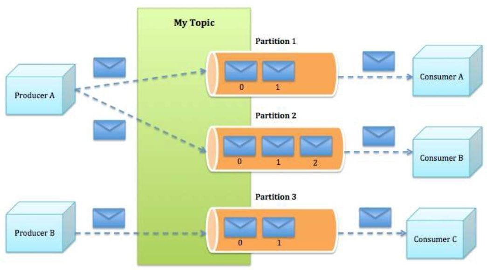

* **Consumer:**
    * Kafka cho phép tạo ra các `Single Consumer` hoặc `Consumer Group`.
    * Một consumer nằm trong cùng `một group` sẽ theo dõi một partition duy nhất, và các consumer khác trong group ấy không thể theo dõi trùng với partition ấy.
    * Nếu các consumer nằm trong cùng `một group`, thì Kafka sẽ đóng vai trò như là `queue` nhằm phân phối record đến các consumer.
    * Nếu các consumer nằm riêng lẻ các `group khác nhau`, thì Kafka sẽ đóng vai trò như là `pub-sub`, nghĩa là toàn bộ record sẽ được broadcast đến toàn bộ consumer riêng lẻ đó.

        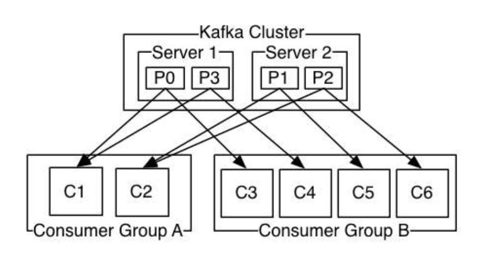

        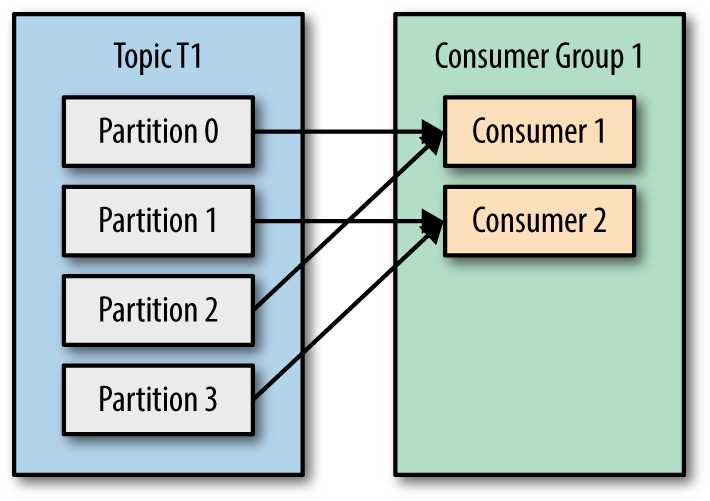

        *Chú thích: Lượng consumer ÍT hơn lượng partition của các topic thì một consumer có thể đảm trách nhiều partition*

        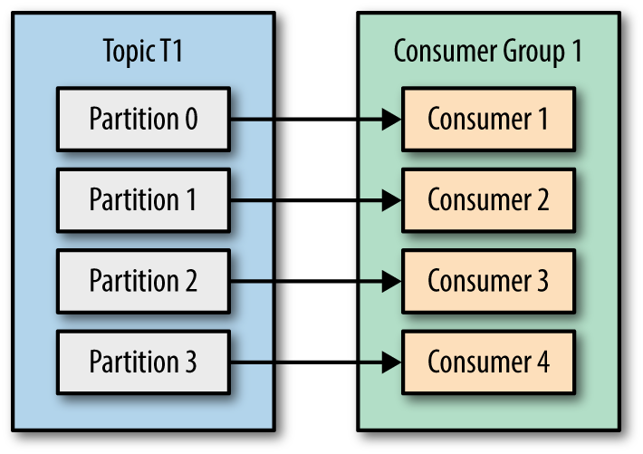

        

        *Chú thích: Lượng consumer NHIỀU hơn lượng partition của các topic thì các consumer thừa sẽ không được sử dụng đến*

    * Điểm mạnh và yếu của `Consumer Group` (Queue) và `Single Consumer` (Pub/Sub):
        * *Consumer Group:* Giúp tăng cường hệ thống tăng cường xử lý khi mỗi consumer sẽ có nhiệm vụ riêng biệt, nghĩa là phân chia việc xử lý dữ liệu cho các consumer thay vì là duy nhất một consumer làm hết.
        * *Single Consumer:* Cho phép broadcast toàn bộ dữ liệu record đến các consumer đơn lẻ. Tuy nhiên, một consumer lại nhận/xử lý quá nhiều record đến thì hiệu năng thật sự không cao, tạo ra áp lực lớn.

* **Điểm tốt của Kafka:**
    * Khả năng mở rộng theo chiều ngang: Kafka là một hệ thống phân tán có thể được mở rộng một cách linh hoạt mà không có thời gian chết (downtime).
    * Đáng tin cậy: Duy trì các record trên đĩa và cho phép nhân bản các partition. Đồng thời, Kafka còn cho phép lượng lớn subsriber/consumer xuất hiện.
* **Các trường hợp sử dụng Kafka**:
    * Website Activity Tracking: Theo dõi hoạt động của Website.
    * Stream Processing: Xử lý stream data.
    * Log Aggregation: Tổng hợp nội dung các dữ liệu record được log.
    * Metrics Collection & Monitoring: Thu thập và giám sát dữ liệu.

        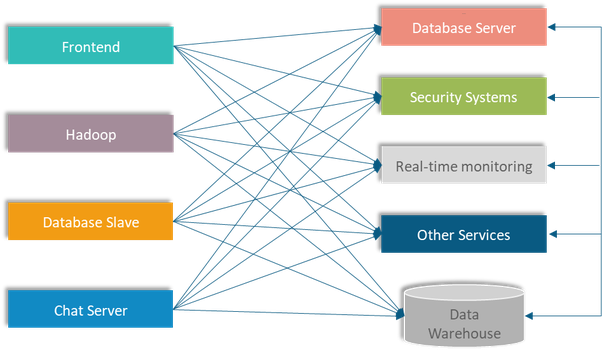

        *Chú thích: Hệ thống không có Kafka sẽ có các "pipeline of stream data" (Đường nối màu xanh biển) rất rườm rà, tăng độ khó trong việc quản lý, thu thập dữ liệu.*

        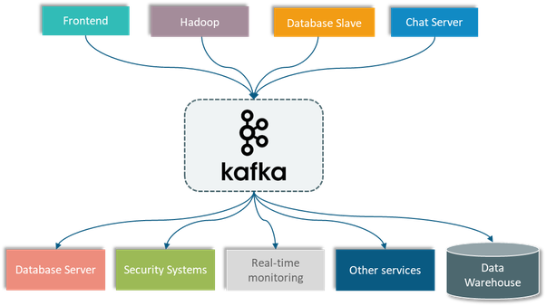

        *Chú thích: Hệ thống có Kafka sẽ có các "pipeline of stream data" (Đường nối màu xanh biển) đi qua Kafka, từ đó nó phân phối/chảy về đúng nơi (server, service, controll), giúp việc quản lý trở nên dễ dàng, dễ quan sát và có khả năng khắc phục sự cố nhanh chóng.*
* **Cách chọn số lượng Partition/Replication phù hợp:** 
    * Số partition quyết định khả năng gửi/nhận record song song, càng nhiều thì hiệu suất hệ thống càng tăng. Mặt khác, việc tăng partition dẫn đến việc xử lý cũng tăng lên (tốn thêm tài nguyên), mức độ ổn định/thứ tự truyển gửi sẽ kém đi,...
    * Số replicate càng cao thì khả năng chịu lỗi càng lớn, và số này cũng phụ thuộc vào số broker. Replicate càng lớn thì lượng sử dụng RAM và dung lượng ổ đĩa của server Kafka cũng tăng.
    * Xem thêm nội dung tại [Kafka - Partitions - Confluent.io](https://www.confluent.io/blog/how-choose-number-topics-partitions-kafka-cluster)

#### NGUỒN THAM KHẢO

* [Apache Kafka ORG](https://kafka.apache.org/intro)
* [Kafka - Codeflex.co](http://codeflex.co/what-is-apache-kafka/)
* [Kafka - Kipalog](https://kipalog.com/posts/Tim-hieu-ve-apache-kafka)
* [Kafka - Topics & Partitions](https://stackoverflow.com/questions/38024514/understanding-kafka-topics-and-partitions)

<br/>

<span name="B"></span>

## SƠ NÉT VỀ ZOOKEEPER

* **Khái niệm:** ZooKeeper là một dịch vụ tập trung để *duy trì thông tin cấu hình, đặt tên, cung cấp đồng bộ hóa phân tán và cung cấp dịch vụ nhóm*.
* **Tính chất:**
    * *Duy trì thông tin cấu hình:* Giúp duy trì thông tin cấu hình cụm được chia sẻ trên tất cả các nút trong cụm.
    * *Đặt tên:*  Zookeeper có thể được sử dụng làm dịch vụ đặt tên, để một nút trong cụm có thể tìm thấy một nút khác trong cụm lớn. Chẳng hạn, cụm nút 1000, cụm nút ABC123.
    * *Cung cấp đồng bộ hóa phân tán:* Có thể sử dụng Zookeeper để giải quyết các vấn đề đồng bộ hóa phân tán trong cụm bằng cách sử dụng khóa, hàng đợi,...
    * *Cung cấp dịch vụ nhóm:* Zookeeper cũng giúp phục vụ nhóm với việc lựa chọn một nút trong cụm lên làm leader.
* **Vai trò của Zookeeper trong Kafka:** Zookeeper được sử dụng để quản lý và điều phối các Kafka broker.
    * Các thông tin cơ bản của Kafka được lưu trữ trong Zookeeper như: Thông tin về các topic, brokers, consumer offset,...
    * Sử dụng chủ yếu cho việc thông báo cho producer và consumer biết thông tin của một broker mới thêm vào hoặc thông tin của một Kafka broker bị lỗi trong hệ thống Kafka.
    * Sau mỗi thông báo của Zookeeper về việc broker thêm vào hay broker bị lỗi thì producer và consumer sẽ quyết định và bắt đầu phối hợp với một broker khác.

        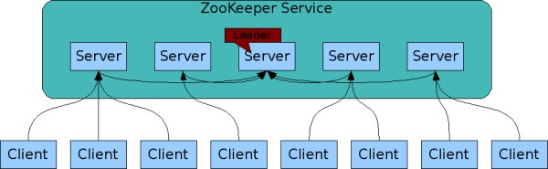

        *Chú thích: Chế độ nhân bản*

        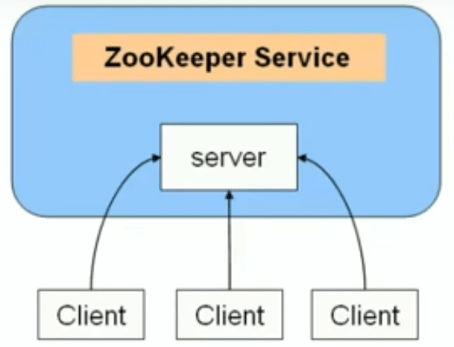

        *Chú thích: Chế độ độc lập*

#### NGUỒN THAM KHẢO

* [Zookeeper Helpex](https://helpex.vn/article/gioi-thieu-ve-zookeeper-5c6b25f4ae03f628d053c432)
* [Zookeeper - Kafka - BlogOfTien](http://tiennv02.blogspot.com/2016/10/tai-lieu-tim-hieu-ve-kafka-va-van-e.html)

<br/>

<span name="C"></span>

## HƯỚNG DẪN CÀI ĐẶT & SỬ DỤNG

**Bước 1:**

Vì Apache Kafka cần Java để khởi chạy, nên ta sẽ cài đặt Java trên HĐH Ubuntu trước.
```
sudo apt update
sudo apt install default-jdk
```

**Bước 2:**

Chọn version Kafka cần tải [tại đây](http://www-us.apache.org/dist/kafka/).

Ở đây, mình sử dụng phiên bản Kafka 2.3.0. Do đó, mình sử dụng lệnh bên dưới để tải phiên bản trên về máy.
```
wget http://www-us.apache.org/dist/kafka/2.3.0/kafka_2.12-2.3.0.tgz
```

Cú pháp tổng quát để tải Kafka theo `<version>`:
```
wget http://www-us.apache.org/dist/kafka/<version>/kafka_2.12-<version>.tgz
```

Giải nén file tgz Kafka và di chuyển thư mục sau khi giải nén đến đường dẫn `/usr/local/kafka`
```
tar xzf kafka_2.12-2.2.1.tgz
mv kafka_2.12-2.2.1 /usr/local/kafka
```

**Bước 3:**

Cài đặt Kafka Python
```
pip3 install kafka-python
```

**Bước 4:**

Sử dụng 5 file bashscript đã được cung cấp sẵn:
* `runKafka.sh`: Chạy dịch vụ Zookeeper và Kafka.
* `createTopicKafka.sh`: Tạo ra 2 topic demo là `user` và `order`, mỗi topic sẽ có 3 partition.
* `describeTopicKafka.sh`: Mô tả thông tin các partition của mỗi topic.
* `consume.sh`: Mỗi topic sẽ được khởi tạo với 3 terminal consumer thông qua code python `consumerUser.py` và `consumerOrder.py`.
* `produce.sh`: Khởi chạy code python `produce.py`, nhằm gửi 200 record đến mỗi topic (user và order).

Sao chép 2 thư mục `./resource/bashscript` và `./resource/python` vào thư mục của Kafka theo đường dẫn `/usr/local/kafka`.

**Bước 5:**

Khởi chạy 2 bashscript theo thứ tự: runKafka, createTopicKafka.
```
cd /usr/local/kafka/bashscript

chmod +x runKafka.sh
./runKafka.sh

chmod +x createTopicKafka.sh
./createTopicKafka.sh
```

*Để dừng chạy Zookeeper và Kafka, chỉ việc nhấn `Ctrl + C` ở các Terminal.*

Nếu như bạn cần thông tin mô tả của các partition của các topic, thực hiện theo lệnh:
```
chmod +x describeTopicKafka.sh
./describeTopicKafka.sh
```

**Bước 6:**

Khởi chạy các consumer
```
chmod +x consume.sh
./consume.sh
```

Khởi chạy producer
```
chmod +x produce.sh
./produce.sh
```

**Chú thích:**
* Replication-factor: Thể hiện có bao nhiêu bản sao dữ liệu sẽ được tạo. Nếu ta chạy với 1 instance thì giá trị là 1.
* Patitions: Mỗi topic có nhiều partition hay không, ở đây dùng để thiết lập số lượng partition mà bạn muốn chia nhỏ topic ra.

*Lưu ý:*
* *Có một số file bashscript sử dụng đến `gnome-terminal`. Khi bạn chạy file bashscript mà thất bại vì lỗi này, hãy cài đặt nó nhé.*
* *Nếu bạn chưa cài đặt python 3, hãy cài đặt nó ngay nhé!*

#### NGUỒN THAM KHẢO

* [Setting Kafka - Tecadmin.net](https://tecadmin.net/install-apache-kafka-ubuntu/)
* [Apache Kafka ORG Quickstart](https://kafka.apache.org/quickstart)
* [Kafka - pypi.org](https://pypi.org/project/kafka-python/)
* [Kafka - towardsdatascience.com](https://towardsdatascience.com/kafka-python-explained-in-10-lines-of-code-800e3e07dad1)
* [Kafka - Java - anirudhbhatnagar.com](https://anirudhbhatnagar.com/2016/08/22/achieving-order-guarnetee-in-kafka-with-partitioning/?fbclid=IwAR0dZ2u8kiAK7GsaOuUuDZB3kpneGnbAZjroL3Yp6tz4JnjJ_aHo-8f-WvU)
* [Kafka - Python - ReadTheDocs](https://kafka-python.readthedocs.io/en/master/usage.html)